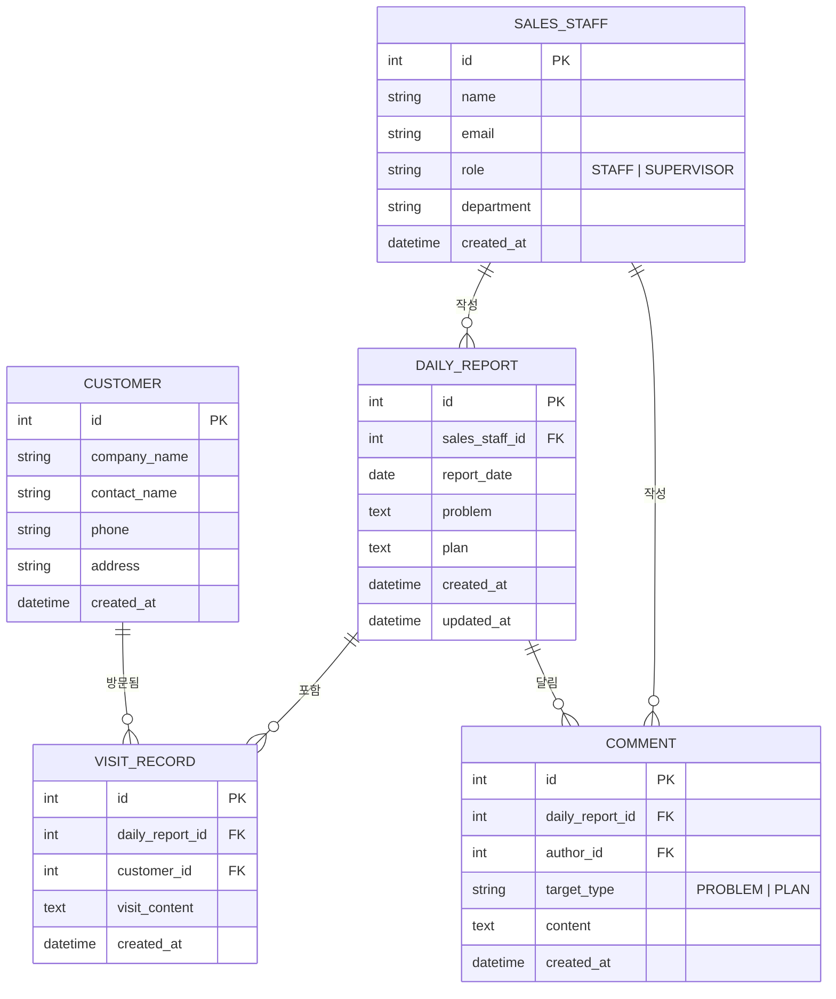

# ER 다이어그램 — 영업 일일 보고 시스템

## 제약 조건

| 테이블 | 제약 |
|---|---|
| `DAILY_REPORT` | `(sales_staff_id, report_date)` UNIQUE — 사원당 하루 1건 |
| `COMMENT.author_id` | `SALES_STAFF.role = 'SUPERVISOR'` 인 사람만 작성 가능 |
| `VISIT_RECORD` | `daily_report_id` 한 건당 행 수 제한 없음, 최소 1건 유지 |
